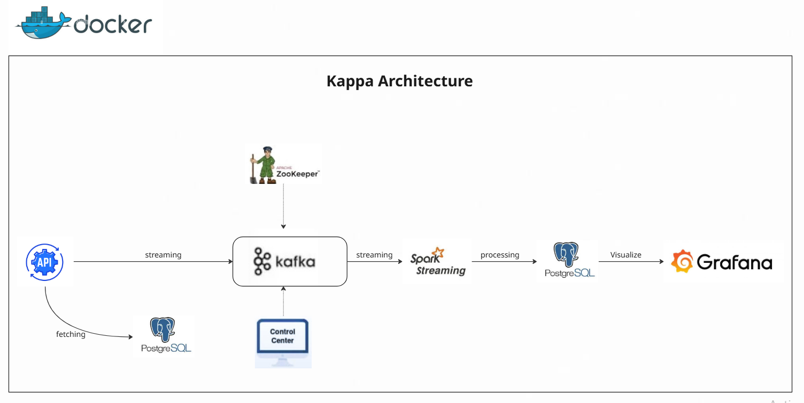

# VoteStream-Realtime-Voting-System
VoteStream is a real-time data pipeline project that simulates a live voting system using modern big data tools.  It demonstrates how to build a fully containerized, real-time streaming application that captures user votes, processes them on the fly, stores the aggregated results, and visualizes live analytics using Grafana. 


# 🖼️ Real-Time Voting System Architecture



---

# 🗳️ Real-Time Voting System

This project is a real-time data pipeline that simulates a voting system, processes incoming votes using Apache Kafka and Apache Spark, stores the results in PostgreSQL, and visualizes the insights using Grafana.

---

## 📌 Project Overview

The system collects votes from users in real-time and provides instant analytics and dashboards showing:

- Total votes per candidate.
- Voter turnout by location.
- Live updating results with latency of only a few seconds.

---

## 🏗️ Architecture (Text-based Overview)

```mermaid
graph LR
A[Vote Generator (Python)] --> B[Kafka Topic: voters_topic]
B --> C[Spark Structured Streaming]
C --> D[PostgreSQL (voting_db)]
D --> E[Grafana Dashboard]

C --> F[Kafka Topic: results_topic] 
F --> G[Another Spark Consumer or Monitoring Tool]
```

---

## ⚙️ Tech Stack

| Component        | Technology                  |
|------------------|-----------------------------|
| Messaging        | Apache Kafka                |
| Stream Processing| Apache Spark Structured Streaming |
| Database         | PostgreSQL                  |
| Dashboard        | Grafana                     |
| Containerization | Docker & Docker Compose     |
| Language         | Python                      |

---

## 🚀 How to Run the Project

### 1. Clone the repo
```bash
git clone https://github.com/yourusername/realtime-voting-system.git
cd realtime-voting-system
```

### 2. Start the Docker containers
```bash
docker-compose up --build
```

### 3. Simulate vote generation
In a separate terminal, run the vote generator:
```bash
docker exec -it voting_app python main.py
```

### 4. Start Spark Stream processing
```bash
docker exec -it spark-container-name python spark-streaming.py
```

> This script consumes from `voters_topic`, processes votes, and writes to PostgreSQL and Kafka `results_topic`.

---

## 📊 Grafana Dashboard

- Grafana is available at: [http://localhost:3000](http://localhost:3000)
- Login: `admin` / `admin`
- Datasource: PostgreSQL (voting_db)
- Sample panels:
  - 🧑‍🤝‍🧑 Turnout by Location
  - 🗳️ Votes per Candidate (Real-Time)

---

## 🧪 Example Queries

```sql
-- Total votes per candidate
SELECT candidate, COUNT(*) FROM votes GROUP BY candidate;

-- Turnout by state
SELECT state, COUNT(*) FROM turnout_by_location GROUP BY state;
```

---

## 📁 Project Structure

```
├── docker-compose.yml
├── main.py                  # Voter generator
├── voting.py                # Kafka consumer + vote logic
├── spark-streaming.ipynb    # Spark Structured Streaming job
├── grafana/                 # Grafana provisioning setup
├── postgres/                # SQL init files
└── README.md
```

---

## 📌 Future Improvements

- Add authentication to voting.
- Store historical vote trends.
- Improve fault-tolerance and checkpointing.

---

## 👨‍💻 Author

Mahmoud Reda  
[LinkedIn]([https://www.linkedin.com/in/mahmoud-reda/](https://www.linkedin.com/in/mahmoud-reda2001/))  
Data Engineer | Passionate about real-time systems

